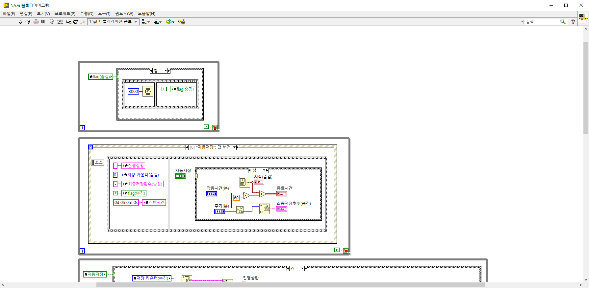
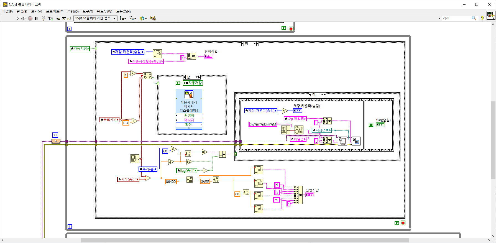
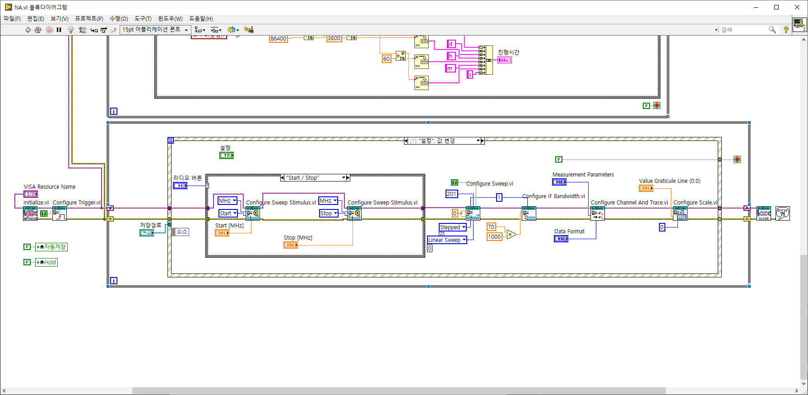
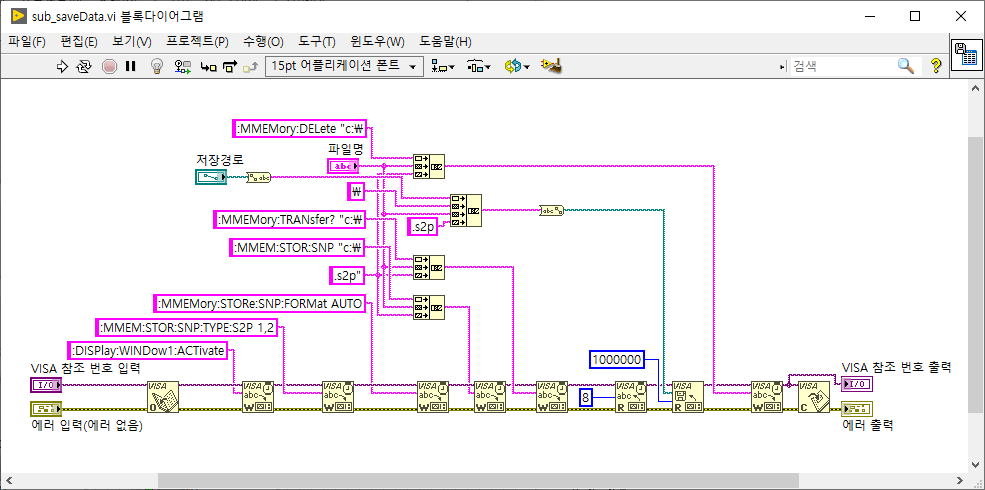
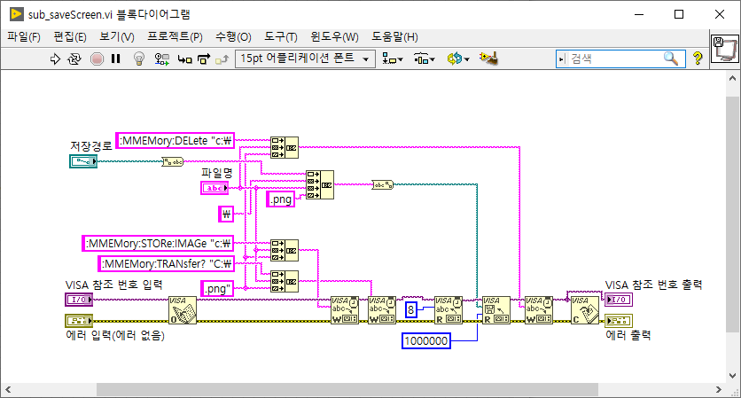
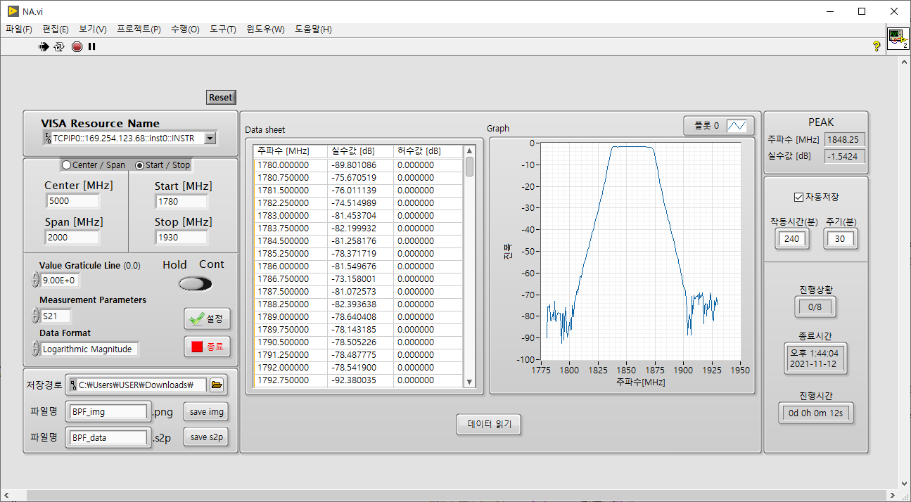
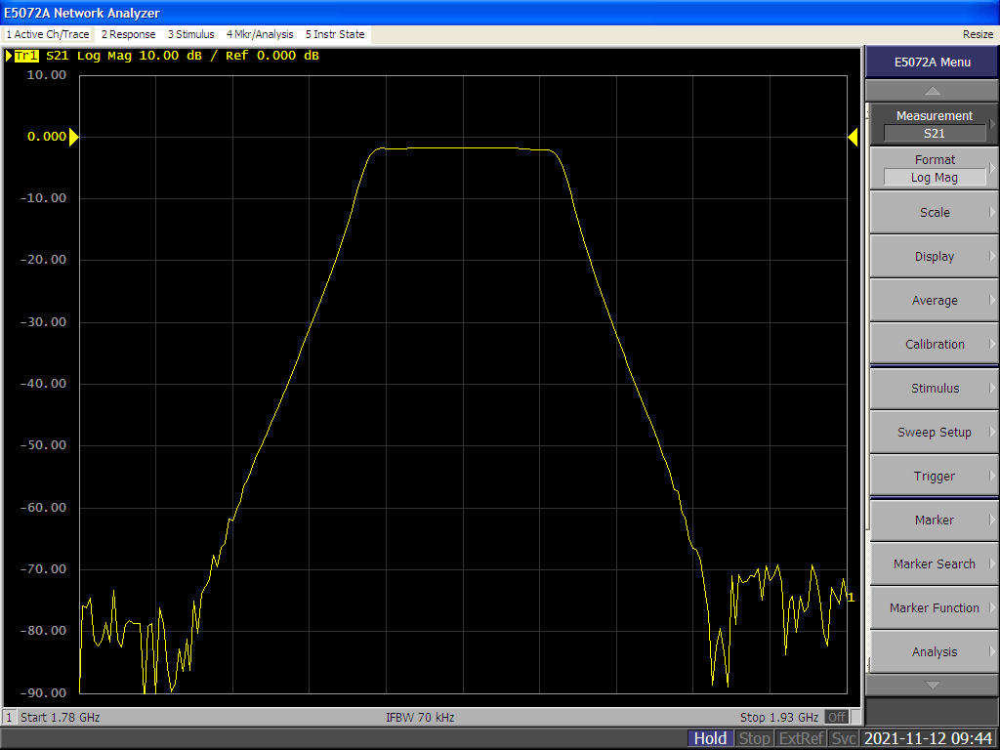

# Network Analyzer_LabVIEW
It is a measurement lab view of Agilent ENA Series network analyzer.

Automatically finds and outputs the maximum value of dB in the corresponding bandwidth. 
Periodically save images and s2p.

## Front Panel

## Block Diagram
NA.iv

sub_saveData.vi

sub_saveScreen.vi

## Demo
BPF 1840~1870MHz

 Front panel
 

 Screen of NA
 

## Development Environment
* Windows 10
* test model : Agilent E5072A Network Analyzer
* NI LabVIEW 2020
