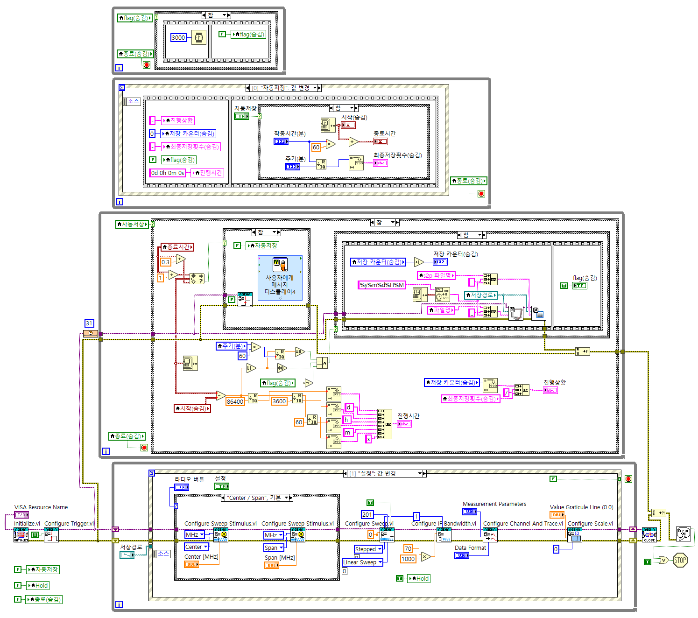

# NA_LabVIEW
It is a measurement lab view of Agilent ENA Series network analyzer.

## Front Pannel

## Block Diagram

## Development Environment
* Windows 10
* test model : Agilent E5072A Network Analyzer
* NI LabVIEW 2020
